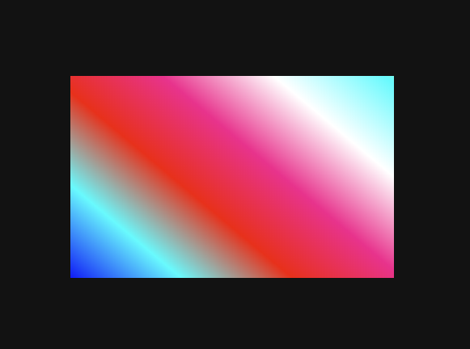
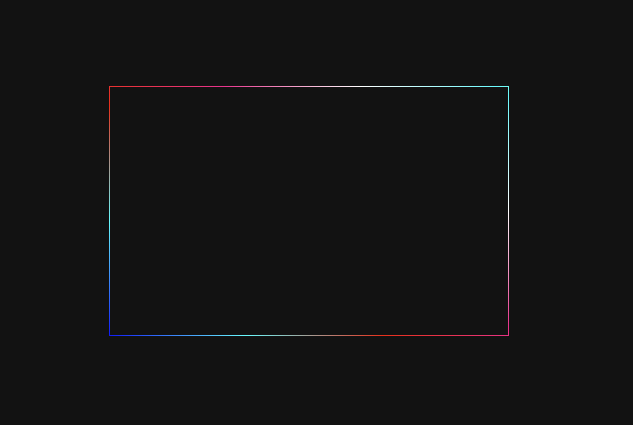

Here a quick example of how you can create an animated multi colour border effect to you element using CSS only

- Creating the project structure

```bash
mkdir animated-border

cd animated-border

touch index.html

touch style.css
```

let's start with a basic html markup. Infact, we only need a empty div with a class for targetting it with CSS

```html
<!-- index.html -->
<!DOCTYPE html>
<html lang="en">
  <head>
    <meta charset="UTF-8" />
    <meta name="viewport" content="width=device-width, initial-scale=1.0" />
    <meta http-equiv="X-UA-Compatible" content="ie=edge" />
    <link rel="stylesheet" href="./style.css" />
    <title>Rotating coloured border</title>
  </head>
  <body>
    <div class="box"></div>
  </body>
</html>
```

let's now style the body. It is not necessary but will add more impact to the final effect

```css
/* style.css */
body {
  width: 100vw;
  height: 100vh;
  background-color: #111;
  display: flex;
  justify-content: center;
  align-items: center;
}
```

now let's style the div thagt we called .box

```css
/* style.css */
.box {
  width: 400px;
  height: 250px;
  background-image: linear-gradient(
    40deg,
    #0000ff,
    #00ffff,
    #ff0000,
    #ff0099,
    #ffffff,
    #00ffff,
    #ffff33,
    #00ff33,
    #ff0099
  );
  background-size: 200%;
  display: flex;
  justify-content: center;
  align-items: center;
}
```

the result vary based on the colours you're gonna chose, but it should look like something like this:



Now we'll cover the unecessary color for giving the border effect. for doing that we are using the pseudo element "before". If you want to learn more about pseudo elements, please refer to [pseudo-elements](https://developer.mozilla.org/en-US/docs/Web/CSS/Pseudo-elements)

```css
/* style.css */
.box&:before {
  content: "";
  width: calc(100% - 2px);
  height: calc(100% - 2px);
  background-color: #111;
}
```

and this should be the result now



One last step missing. If we want to make the border move, we have to animate it using keyframes.

```css
/* style.css */
@keyframes flashy {
  0% {
    background-position: 0 0;
  }
  33% {
    background-position: 500% 0;
  }
  66% {
    background-position: 0 0;
  }
  100% {
    background-position: 500% 0;
  }
}

/* and use this animation on the .box element */

.box {
  /* ... */
  animation: flashy 10s linear infinite;
}
```

Here you can find the final code and the video for this example:

- ##### [Get the code](https://codepen.io/polettoweb/pen/NQPypa)

- ##### [YouTube video](https://www.youtube.com/watch?v=vCbYH3r4Uv8)
